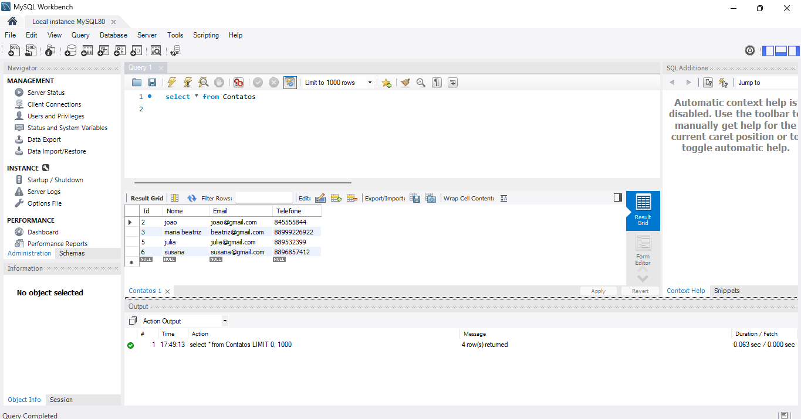

# CRUD de Agenda de Contatos

Este projeto é um exemplo simples de uma aplicação de CRUD (Create, Read, Update, Delete) de controle de contatos utilizando C#/.NET e MySQL.

## Imagem de Demonstração

## Funcionalidades

- **Adicionar Contato**: Permite adicionar novos contatos à agenda.
- **Visualizar Contatos**: Exibe a lista de contatos salvos.
- **Editar Contato**: Permite editar as informações de um contato existente.
- **Deletar Contato**: Permite remover um contato da agenda.

